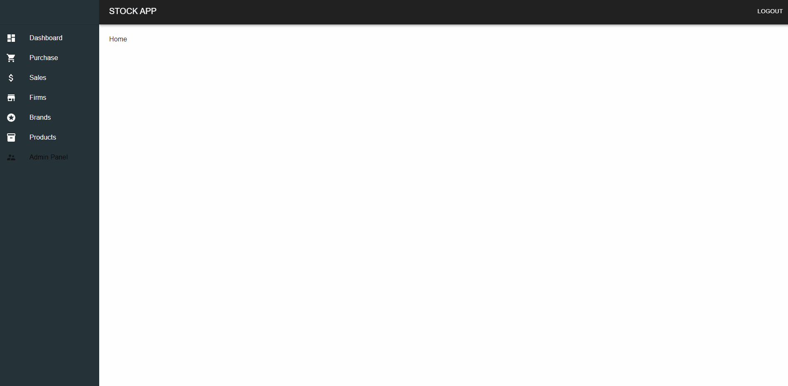

# Stock App Frontend
<h3>Visit: https://stock-frontend-six.vercel.app/</h3>

Stock Management System, a web app for inventory and sales, includes a user-friendly dashboard, dynamic charts, and brand/firm management. It employs React, Material-UI, Tremor Chart, Formik, Yup, and Axios for functionality. The Sales and Performance components handle sales data visualization, utilizing an API for data retrieval.
